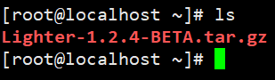
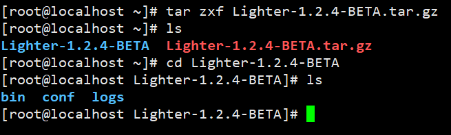
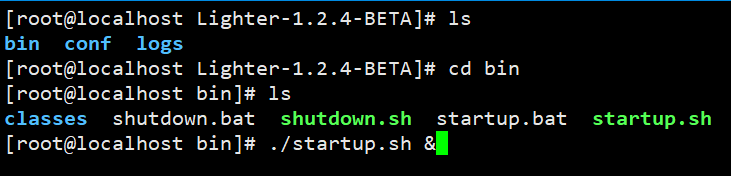
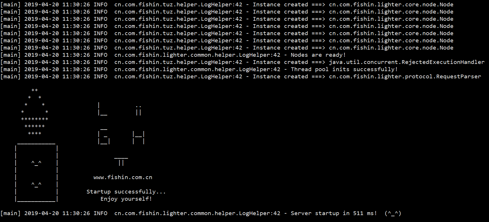
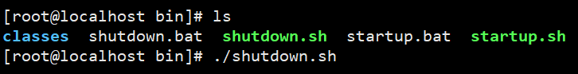

# Lighter 使用手册

1. 首先下载 Lighter 的压缩包
    + 压缩包下载地址： 
        + [码云地址](https://gitee.com/FishGoddess/Lighter/releases)
        + [GitHub](https://github.com/FishGoddess/Lighter/releases)

2. 当你下载好压缩包之后，就成功了一大半啦！
    + 在 Linux 系统上如何启动 Lighter 服务？
        
        a. 使用 `ls` 命令查看下载好的文件

        
        
        b. 使用 `tar` 命令解压文件
        
        
        
        c. 解压之后得到一个目录，使用 `cd` 命令进入目录，进去之后可以看到三个目录
        
        + 首先来看 `bin` 目录，这是二进制文件所在的目录，运行服务和关闭服务的脚本都在这个目录下
        + 让我们来启动服务吧！！
        + 执行 `./startup.sh` 即可启动，当然，我们建议你使用后台启动方式，如图中：
        
        
        
        + 你或许会担心以后台形式启动会看不到日志，不用担心，后面会提到日志在哪
        
        + 如果你足够幸运，就可以看到下面这个 Lighter 图标：
        
        
        
        + 到这里，服务就完全启动啦！！
        
        + 注意：由于运行需要权限，如果你发现运行时显示`没有权限`，就先使用 `chmod` 赋予权限
                
        
        
        + 如果你需要关闭服务，当然，我们不建议你这么做哈哈，但如果你坚持要这么做，可以执行 `shutdown.sh` 脚本
        
        
        
        
        
    + 在 Windows 系统上如何启动 Lighter 服务？
    
        a. 同样需要下载到 Lighter 的压缩包，这里就不赘述了，解压到一个目录下
        
        b. 进入到这个目录，同样有三个目录，进入到 `bin` 目录下，双击 `startup.bat` 即可启动
        
        c. 如果需要关闭服务，双击 `shutdown.bat` 即可

3. 服务运行中，日志在哪？
    
    在得到的目录中，有三个目录，`bin` / `conf` / `logs`
    
    我想聪明的你已经猜到了，日志就是存放在 `logs` 目录，它以时间进行分割日志文件，一天一个日志文件
    
    
    
    如果你需要配置服务，进入 `conf` 目录，打开 `config.properties` 文件进行配置即可
    
    如果你需要配置日志信息，进入 `bin` / `classes` 目录，打开 `logback.xml` 文件进行配置即可