# Lighter 轻量级对象缓存服务中间件 [](https://www.apache.org/licenses/LICENSE-2.0.html)
(目前主分支是 rebuild，如果在代码设计和风格统一上存在问题，请在评论区留言)

+ 使用 HTTP 请求作为网络协议，跨平台跨语言
+ 可以直接与客户端相连，也可以在后端作为第一层缓存中间件存在
+ 支持自定义的节点实现，默认带有一个节点实现
+ 默认节点具备懒回收和哨兵回收两种过期回收机制

### 1. 使用用途：
主要用作于对象缓存，带有默认的缓存实现，并且允许多个节点的缓存，这也实现了负载均衡和分布式缓存。

使用 `Tuz` 做容器托管（`Tuz` 是我写的另外一个开源项目：[Tuz 资源容器](https://gitee.com/FishGoddess/Tuz)，已发布到 [maven 中心仓库](https://mvnrepository.com/artifact/cn.com.fishin/Tuz)），并利用它的 IOC 技术和拦截器技术做业务解耦。

在网络通信方面使用的是 `Netty`，并且实现了 `HTTP` 下的传输协议。

整个项目的所有组件都允许自定义，包括缓存实现、节点选择、协议解析和网络通信协议，你只需要非常简单的实现一个接口即可。

+ #### 留言网站：[https://www.fishin.com.cn](https://www.fishin.com.cn)

+ #### 联系方式：fishinlove@163.com

+ #### 开源协议：[Apache License 2.0](https://www.apache.org/licenses/LICENSE-2.0.html)

### 2. 使用步骤：
详细请参考 [HowToUse.md](./HowToUse.md) 文件
1. 首先下载 Lighter 的压缩包
    + 压缩包下载地址： 
        + [码云地址](https://gitee.com/FishGoddess/Lighter/releases)
        + [GitHub](https://github.com/FishGoddess/Lighter/releases)

2. 当你下载好压缩包之后，就成功了一大半啦！
    + 在 Linux 系统上如何启动 Lighter 服务？
        
        a. 使用 `ls` 命令查看下载好的文件

        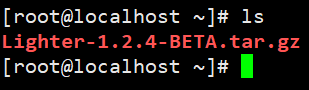
        
        b. 使用 `tar` 命令解压文件
        
        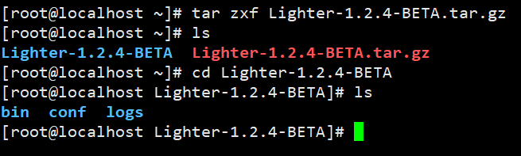
        
        c. 解压之后得到一个目录，使用 `cd` 命令进入目录，进去之后可以看到三个目录
        
        + 首先来看 `bin` 目录，这是二进制文件所在的目录，运行服务和关闭服务的脚本都在这个目录下
        + 让我们来启动服务吧！！
        + 执行 `./startup.sh` 即可启动，当然，我们建议你使用后台启动方式，如图中：
        
        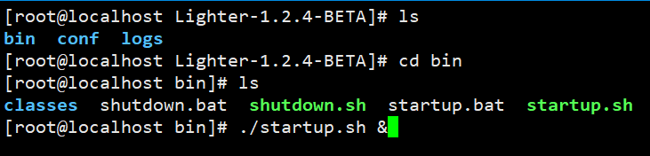
        
        + 你或许会担心以后台形式启动会看不到日志，不用担心，后面会提到日志在哪
        
        + 如果你足够幸运，就可以看到下面这个 Lighter 图标：
        
        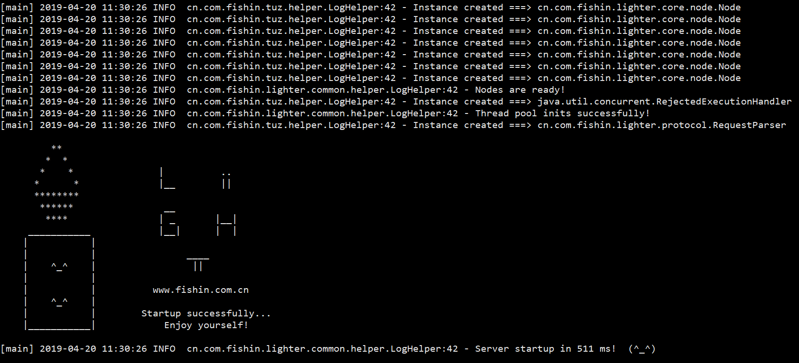
        
        + 到这里，服务就完全启动啦！！
        
        + 注意：由于运行需要权限，如果你发现运行时显示`没有权限`，就先使用 `chmod` 赋予权限
                
        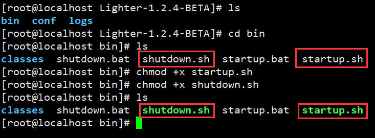
        
        + 如果你需要关闭服务，当然，我们不建议你这么做哈哈，但如果你坚持要这么做，可以执行 `shutdown.sh` 脚本
        
        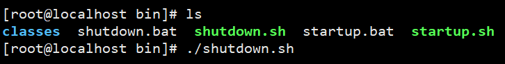
        
        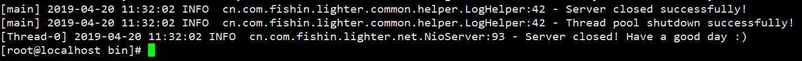
        
    + 在 Windows 系统上如何启动 Lighter 服务？
    
        a. 同样需要下载到 Lighter 的压缩包，这里就不赘述了，解压到一个目录下
        b. 进入到这个目录，同样有三个目录，进入到 `bin` 目录下，双击 `startup.bat` 即可启动
        c. 如果需要关闭服务，双击 `shutdown.bat` 即可

3. 服务运行中，日志在哪？
    
    在得到的目录中，有三个目录，`bin` / `conf` / `logs`
    
    我想聪明的你已经猜到了，日志就是存放在 `logs` 目录，它以时间进行分割日志文件，一天一个日志文件
    
    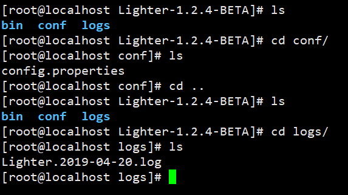
    
    如果你需要配置服务，进入 `conf` 目录，打开 `config.properties` 文件进行配置即可
    
    如果你需要配置日志信息，进入 `bin` / `classes` 目录，打开 `logback.xml` 文件进行配置即可 

### 请求例子：
下面这个协议完整版请点击：[Lighter 使用的 Http 协议](./protocol/HttpProtocol.md)。

这个协议目前实现的是 HTTP 请求，建议使用 Restful 的风格发送请求：
1. get 动作，获取一个对象:
    + 例子：http://127.0.0.1:9669/get/testKey
    + testKey 为对象的 key 值
    + **建议使用 `GET 请求`**
    + 注意：返回值是一个 json 对象数组
    
2. set 动作，保存一个对象:
    + 例子：http://127.0.0.1:9669/set/testKey
    + testKey 为对象的 key 值
    + **建议使用 `POST 请求`**
    + **建议使用 Content-Type: application/json;charset=utf-8**
    + 注意：返回值是一个 json 对象数组
    
    请求体：
    ```json
    {
        "key1": "value1",
        "key2": "value2",
        "key3": "value3",
        "key4": "value4"
    }
    ```
    或者是：
    ```text
    任意字符串
    ```

3. setAbsent 动作，如果对象键值不存在才保存:
    + 例子：http://127.0.0.1:9669/setAbsent/testKey
    + testKey 为对象的 key 值
    + 如果 key 值不存在才保存
    + **建议使用 `POST 请求`**
    + **建议使用 Content-Type: application/json;charset=utf-8**
    + 注意：返回值是一个 json 对象数组
        
    请求体：
    ```json
    {
       "key1": "value1",
       "key2": "value2",
       "key3": "value3",
       "key4": "value4"
    }
    ```
    或者是：
    ```text
    任意字符串
    ```
    
4. remove 动作，删除一个对象:
    + 例子：http://127.0.0.1:9669/remove/testKey
    + testKey 为对象的 key 值
    + **建议使用 `DELETE 请求`**
    + 返回删除的这个对象
    
5. exists 动作，判断一个对象 key 是否存在:
    + 例子：http://127.0.0.1:9669/exists/testKey
    + testKey 为对象的 key 值
    + **建议使用 `GET 请求`**
    + 返回 true 如果这个 key 存在
    
6. expiredTime 动作，判断一个对象 key 的存活时间:
    + 例子：http://127.0.0.1:9669/expiredTime/testKey
    + testKey 为对象的 key 值
    + **建议使用 `GET 请求`**
    + 返回值的意义：
        + -2：这个 key 值不存在或者已经过期
        + -1：这个 key 永不过期
        + 正数：这个 key 的存活时间，大于 0 的一个数，等这个值变成 0，就意味着这个值已经过期
    
7. lighter 动作，获取 Lighter 服务运行的信息
    + 例子：http://127.0.0.1:9669/lighter/info
    + 目前支持 keys、values、numberOfKeys、info 等动作
    + info 为系统运行所有信息，包含上面几个系统动作的功能
    + **建议使用 `GET 请求`**
    + 返回系统运行信息
    ```json
    {
      "code": 0,
      "data": [
        {
          "keys": {
            "node_15": [],
            "node_14": [],
            "node_0": [],
            "node_1": [],
            "node_2": [
              "tehjhs"
            ],
            "node_3": [
              "bsdf"
            ],
            "node_4": [],
            "node_5": [],
            "node_13": [
              "gdsgas"
            ],
            "node_6": [
              "%E5%B9%BF%E6%B3%9B%E7%9A%84%E5%99%B6"
            ],
            "node_12": [
              "tyret"
            ],
            "node_7": [],
            "node_11": [
              "gdsa"
            ],
            "node_8": [],
            "node_10": [],
            "node_9": [
              "ghfdhfd"
            ]
          },
          "values": {
            "node_15": [],
            "node_14": [],
            "node_0": [],
            "node_1": [],
            "node_2": [
              "{  \"key1\": \"value1\",  \"key2\": \"value2\"}"
            ],
            "node_3": [
              "{  \"key1\": \"value1\",  \"key2\": \"value2\"}"
            ],
            "node_4": [],
            "node_5": [],
            "node_13": [
              "{  \"gsda\": \"gsdfga\",  \"风格的yrtruhjm放大\": \"gdfgad灌水广\"}"
            ],
            "node_6": [
              "{  \"key1\": \"value1\",  \"key2\": \"value2\"}"
            ],
            "node_12": [
              "{  \"key1\": \"value1\",  \"key2\": \"value2\"}"
            ],
            "node_7": [],
            "node_11": [
              "{  \"key1\": \"value1\",  \"风格的放大\": \"gdfgad灌水广\"}"
            ],
            "node_8": [],
            "node_10": [],
            "node_9": [
              "{  \"key1\": \"value1\",  \"key2\": \"value2\"}"
            ]
          },
          "numberOfKeys": {
            "total": 7,
            "details": {
              "node_15": 0,
              "node_14": 0,
              "node_0": 0,
              "node_1": 0,
              "node_2": 1,
              "node_3": 1,
              "node_4": 0,
              "node_5": 0,
              "node_13": 1,
              "node_6": 1,
              "node_12": 1,
              "node_7": 0,
              "node_11": 1,
              "node_8": 0,
              "node_10": 0,
              "node_9": 1
            }
          },
          "numberOfNodes": 16
        }
      ],
      "msg": "Done",
      "success": true
    }
    ```


### 3. 使用到的依赖：
```xml
<properties>
    <tuz.version>0.6.6-FINAL</tuz.version>
    <netty.version>4.1.33.Final</netty.version>
    <fastjson.version>1.2.56</fastjson.version>
    <logback.version>1.2.3</logback.version>
</properties>
```
#### i. Tuz 作为整个项目的容器，使用到了它的 IOC 技术和拦截器技术 
#### ii. Netty 作为整个项目的网络通信模块，使用到了它的 NIO 网络通信服务
#### iii. fastJson 作为协议解析器的一部分，是 Json 协议的解析库
#### iiii. logBack 作为项目的日志模块，使用 SLF4J 接口对接

### 4. 项目架构：
+ 性能测试
    + 计算机硬件：
    
    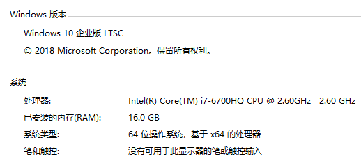
    + 单次操作，1000 个线程，10 万个请求，吞吐量：平均 11000 次/秒
    
    
        
    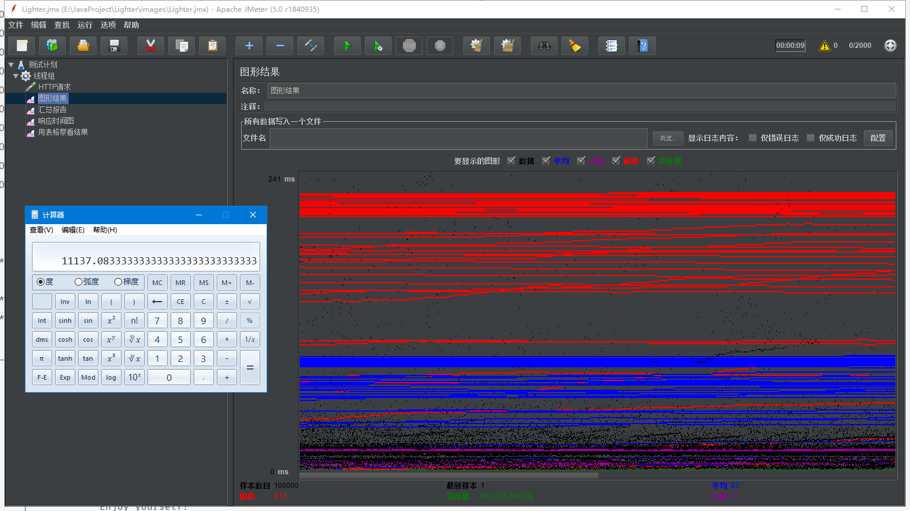
            
    + 混合操作，几种基本操作同时进行，1000 个线程，10 万个请求，平均 8000 次/秒
    
    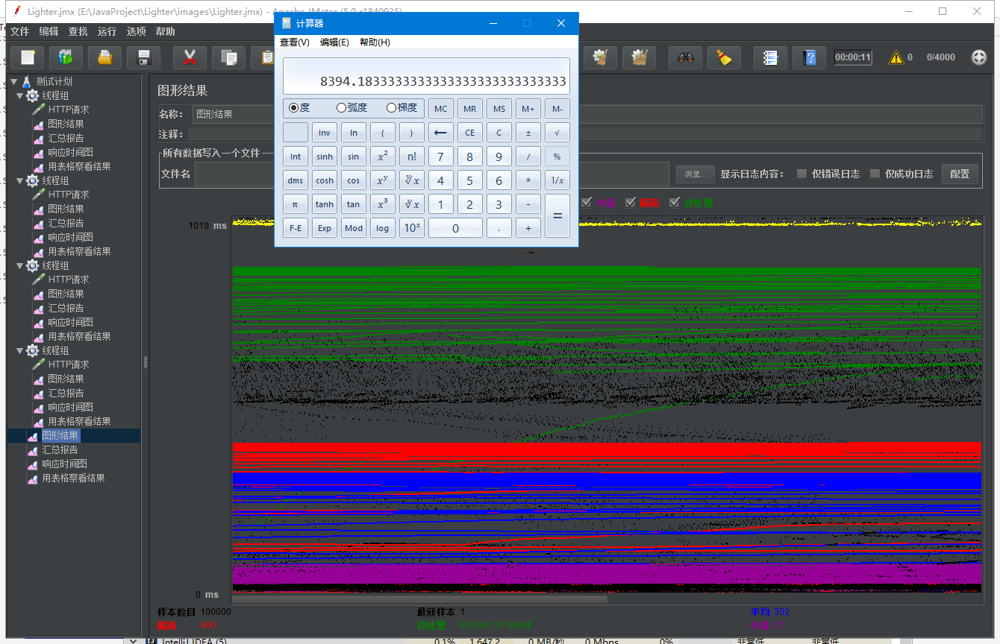
            
具体测试文件在 images 下，为 Lighter.jmx，是一个 JMeter 的测试计划

+ 具体配置文件详见 resources/conf/config.properties
```properties
#############################################################
# Lighter 服务配置文件 v1.3.3
# 下面的配置仅仅是为了定制化 Lighter 服务，如没有这个需求，请不要随便改动
#                                          2019-4-15   水不要鱼
#############################################################

# 服务器监听端口
# 这个端口是内置服务器使用的通信端口，默认是 Netty 实现的 Nio 服务器
server.port=9669

# 服务器监听的关闭端口
# 由于服务器是运行且阻塞等待的，所以需要使用网络通信来关闭服务器
# 默认情况下会开启一个监听线程，只要监听到这个端口有客户端连接就关闭服务器
server.closePort=9999

# 服务器初始化器
# 这个服务器具体使用什么网络模式来进行和客户端的通信也是可以自定义的
# 你可以增加一个你自己的服务器初始化器以实现你想要的通信方式，只需实现一些方法即可
# 由于整个服务器使用的是 Netty 来通信的，所以如果你准备改写这个服务器初始化器
# 你最好具备有 Netty 的编程经验，否则可能导致服务不可用的后果
# 同时，由于默认使用的是 HTTP 协议，所以在请求时可能会产生大量的冗余信息
# 这在高并发访问下会浪费大量的网络资源，我也注意到了这一点
# 只是单从使用的角度上来说的话，HTTP 协议的确更加方便，同时可以跨平台跨语言以及高兼容性
# 所以就选择了 HTTP 协议来作为默认的应用协议
ChannelInitializer=cn.com.fishin.lighter.net.http.HttpServerInitializer

# 协议解析器
# 当接收到用户的请求时，需要解析成一个任务对象提供给任务执行器去执行
# 你可以自定义协议解析器，以此来实现你的特殊业务解析或者实现你自己的协议
# 你只需实现 cn.com.fishin.lighter.protocol.RequestParser 接口
# 然后重写 parse 方法，将用户请求解析成一个任务对象返回即可
RequestParser=cn.com.fishin.lighter.protocol.http.HttpRequestParser

# 线程池属性
# 属性包含：核心线程数 & 最大线程数 & 线程存活时间 & 等待队列大小 & 队列拒绝策略
# 注意：以下属性需要对 JDK 中的线程池有一定的了解才可以更改，否则请保持默认设置
# 具体可以参考 java.util.concurrent.ThreadPoolExecutor 线程池类
# 底层执行器使用线程池来执行任务，你可以设置这个线程池的核心线程数以及最大线程数
# 这两个值需要根据系统性能以及具体业务并发量而定，另外，一个系统也会对线程数量有限制
# 在 JVM 中可以设置线程栈大小，这个大小对可以使用的线程数量有影响，详情参考 JVM 指令
# 同时，由于线程之间切换会有开销，所以如果使用的是内存型的节点实现，请保持线程数在 CPU 线程数的两倍以内
# 如果节点实现是 I/O 或者网络型的，可以适当调高比例，比如调节成 CPU 线程数的四倍甚至更高
corePoolSize=8
maximumPoolSize=64
# 线程存活时间的设置和一个任务执行的时间应该差不多，由于这个任务一般是短时间任务
# 所以这个值不建议设置的太大，应该要设置为任务执行时间的 2 倍左右，这样可以复用大量线程
keepAliveTime=30
# 等待队列大小和队列拒绝策略一般会有关联，当队列满了就会开始新增线程，当最大线程数达到了
# 这个线程池就会执行拒绝策略，由于 Lighter 是一个对象缓存服务，因此是允许缓存不命中的情况的
# 但是这个值不应该设置得太小，以免造成缓存雪崩和缓存穿透，需要结合系统性能来决定大小
waitQueueSize=4096
RejectedExecutionHandler=cn.com.fishin.lighter.core.DefaultRejectedExecutionHandler

# 节点个数
# Lighter 服务器将支持多节点管理，每个节点可以是一个独立的服务器，甚至是集群
# 这个节点数量不能设置的太大，应该要根据业务来定，如果业务需要较多节点，你可以设置大数量
# 另外，Lighter 只提供默认的节点实现，这个节点实现很难满足高并发下的所有需求
# 所以，我推荐自己实现一个节点，结合业务进行定制，让 Lighter 单纯作为缓存中间件也是可以的
numberOfNodes=16

# 节点实现类
# 这是默认实现节点，一般情况下可以使用，但如果是高并发的场景下，还是建议再重写一个节点实现
# 尽可能地和业务场景相契合，毕竟通用的实现无法满足所有情况，尤其是在性能上
# 默认使用 java.util.concurrent.ConcurrentHashMap 来存储数据，保证了并发的安全
# 此外，为了防止大数据量时 Map 的扩容导致性能损失，这里针对初始值进行了调整，
# 由于线程数肯定是根据业务量来定的，所以这里取线程数的两倍作为初始值，在代码中可以看到这一行：
# private static final int INITIAL_CAPACITY = (Integer.valueOf(Tuz.use("corePoolSize")) << 2);
Node=cn.com.fishin.lighter.core.node.DefaultNode

# 节点选择器
# 当接收到一个任务时，选择在哪个节点上执行就需要靠这个节点选择器来选择了
# 默认内置两个实现，一个是负载均衡选择器，一个是 key 哈希选择器
# 负载均衡选择器会在所有节点中执行，另外，由于缓存数据不需要强一致性，
# 所以这里的负载均衡没有使用高扩展性，也就是说其中一台机器崩溃了，其他机器不会有所感知
# 即使没有执行成功，也不会再去执行，也就有可能导致负载均衡的所有机器上数据并不一定完全一致
# key 哈希选择器使用哈希算法，将任务分散到不同的节点上执行，这是初步的分布式缓存实现
# 这个选择器同样是弱一致性的，也就是说其中一台机器崩溃，导致的任务丢失是允许的
# 在默认节点实现下，这个崩溃的可能性几乎不存在，但如果是自定义的节点实现，比如 redis 节点实现
# 就有可能因为机器故障而导致节点写入失败等操作问题，此时将失去这个哈希的范围，也就是缓存命中失败
NodeSelector=cn.com.fishin.lighter.core.selector.KeyHashNodeSelector

# 允许访问服务的主机域名
# 由于跨域需要设置这个 HTTP 响应头，只有在这个响应头列表内的才可以访问服务
# 设置 * 将允许所有主机访问，这在一定程度不安全，但如果你是打算做一个公开的服务
# 这个选项就需要设置为 * 以便允许所有主机访问
AccessControlAllowOrigin=*

# 清理过期键值的时间间隔，单位：秒
# 这个参数仅仅针对默认节点实现，由于假过期时间会造成内存浪费，
# 所以还是需要一个哨兵线程去不断地把已经过期的键值清理掉，以免造成大量过期键值堆积
# 这个值不能设置的太小！！否则这个服务就变成清理服务了。。。
# 建议和业务相联系，默认值是 60 秒执行一次清理
GcPerSecond=60
```

### 主要接口如下：

(1) cn.com.fishin.lighter.core.node.Node 节点接口类

(2) cn.com.fishin.lighter.core.selector.NodeSelector 节点选择器

(3) cn.com.fishin.lighter.core.executor.TaskExecutor 任务执行器

(4) cn.com.fishin.lighter.protocol.RequestParser 协议解析器

(5) cn.com.fishin.lighter.protocol.RequestHandler 辅助协议解析器

### 分为解析和执行两步

#### 解析：
1. 客户端通过网络通信传输协议内容
2. 协议解析器将协议解析为一个任务对象，交给任务执行器执行

#### 执行：
1. 任务执行器将任务交给线程池执行，这个任务将被封装成一个 FutureTask 执行
2. 节点管理器将任务分配到具体的一个节点或者一些节点执行，得到结果返回

